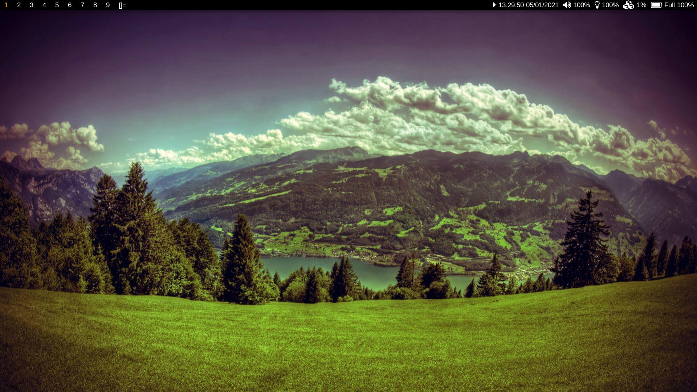
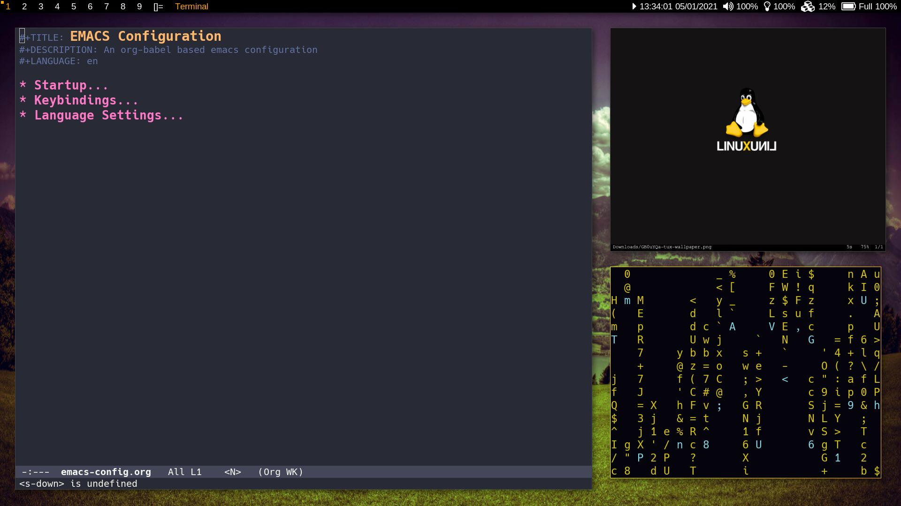

## dot

my Linux configuration
<em>(produced via combining my builds of suckless' dwm, slstatus, and dmenu)</em>





### my build of [dwm](https://dwm.suckless.org/)

#### features
- move windows up and down the stack via the [movestack](https://dwm.suckless.org/patches/movestack/) patch
- toggle full-screen mode for windows via the [fullscreen](https://dwm.suckless.org/patches/fullscreen/) patch
- add inner and outer gaps between windows via the [vanitygaps](https://dwm.suckless.org/patches/vanitygaps/) patch
- black and orange color scheme

<details>

<summary>
 key bindings (click to expand)
</summary>

##### Basics
<table>
<thead>
<tr>
<th>Key Binding</th>
<th>Function</th>
</tr>
</thead>
<tbody>

<tr>
<td>Super + p</td>
<td>spawn dmenu</td>
</tr>

<tr>
<td>Super + Return</td>
<td>spawn <strong>mate-terminal</strong></td>
</tr>

<tr>
<td>Super + Shift + e</td>
<td>quit dwm</td>
</tr>

<tr>
<td>Super + Shift + q</td>
<td>kill active window</td>
</tr>

<tr>
<td>Super + 0</td>
<td>view all tags</td>
</tr>

<tr>
<td>Super + [1-9]</td>
<td>go to selected tag</td>
</tr>

<tr>
<td>Super + Tab</td>
<td>jump to previous tag</td>
</tr>

</tbody>
</table>

##### Master Window
<table>
<thead>
<tr>
<th>Key Binding</th>
<th>Function</th>
</tr>
</thead>
<tbody>

<tr>
<td>Super + i</td>
<td>increase the number of master windows</td>
</tr>

<tr>
<td>Super + d</td>
<td>decrease the number of master windows</td>
</tr>

<tr>
<td>Super + l</td>
<td>increase the size of master windows</td>
</tr>

<tr>
<td>Super + h</td>
<td>decrease the size of master windows</td>
</tr>

</tbody>
</table>

##### Active Window
<table>
<thead>
<tr>
<th>Key Binding</th>
<th>Function</th>
</tr>
</thead>
<tbody>

<tr>
<td>Super + j</td>
<td>shift window focus down the stack</td>
</tr>

<tr>
<td>Super + k</td>
<td>shift window focus up the stack</td>
</tr>

<tr>
<td>Super + Shift + j</td>
<td>move the active window down the stack</td>
</tr>

<tr>
<td>Super + Shift + k</td>
<td>move the active window up the stack</td>
</tr>

<tr>
<td>Super + Shift + 0</td>
<td>make the active window visible on all tags</td>
</tr>

<tr>
<td>Super + Shift + [1-9]</td>
<td>move the active window to the selected tag</td>
</tr>

<tr>
<td>Super + f</td>
<td>toggle full-screen</td>
</tr>

</tbody>
</table>

##### Gaps
<table>
<thead>
<tr>
<th>Key Binding</th>
<th>Function</th>
</tr>
</thead>
<tbody>

<tr>
<td>Super + Shift + l</td>
<td>increase gap size</td>
</tr>

<tr>
<td>Super + Shift + h</td>
<td>decrease gap size</td>
</tr>

<tr>
<td>Super + g</td>
<td>toggle gaps</td>
</tr>

<tr>
<td>Super + Shift + g</td>
<td>set gaps to default size</td>
</tr>

</tbody>
</table>

##### Other
<table>
<thead>
<tr>
<th>Key Binding</th>
<th>Function</th>
</tr>
</thead>
<tbody>

<tr>
<td>Super + b</td>
<td>toggle status bar</td>
</tr>

<tr>
<td>Super + Space</td>
<td>switch layouts</td>
</tr>

<tr>
<td>Super + Shift + Space</td>
<td>float active window</td>
</tr>

<tr>
<td>Super + ,</td>
<td>shift focus to the next monitor</td>
</tr>

<tr>
<td>Super + Shift +  ,</td>
<td>move the active window to the next monitor</td>
</tr>

</tbody>
</table>

 </details>

<em>optional:</em> redefine the termcmd variable in [config.h](dwm/config.h) to change default <em>(mate-terminal)</em> terminal

### my build of [slstatus](https://tools.suckless.org/slstatus/)

#### features
- custom; date, volume, brightness (multiple monitors known to cause issues) modules 
	* these modules are system specific, and as such are not guaranteed to work
	  on all systems, feel free to edit them [here](slstatus/config.h)
- vanilla; cpu, battery modules
- black and orange color scheme

### my build of [dmenu](https://tools.suckless.org/dmenu/)

#### features
- set window position and width via the [xyw](https://tools.suckless.org/dmenu/patches/xyw/) patch
- black and orange color scheme

##### dependencies
<ul>
	<li>git</li>
	<li>xorg</li>
	<li>libx11-dev</li>
	<li>libxft-dev</li>
	<li>libxinerama-dev</li>
	<li>xdm</li>
	<li>suckless-tools</li>
	<li>dmenu</li>
	<li>fonts-hack-ttf</li>
	<li>fonts-font-awesome</li>
	<li>pamixer</li>
	<li>xrandr</li>
	<li>mate-terminal</li>
</ul>

### installation
to install everything: first install all dependencies, then run;

```
cd ~
git clone https://github.com/r760/dot
cd dot
chmod +x dot
./dot install
```

to auto start slstatus you can append the following to ~/.profile
```
# start slstatus
killall -q slstatus
while pgrep -u $UID -x slstatus > /dev/null; do sleep 1; done
slstatus &
```
### uninstallation
to uninstall everything (except dependencies)
```
cd ~/dot
./dot uninstall
```
